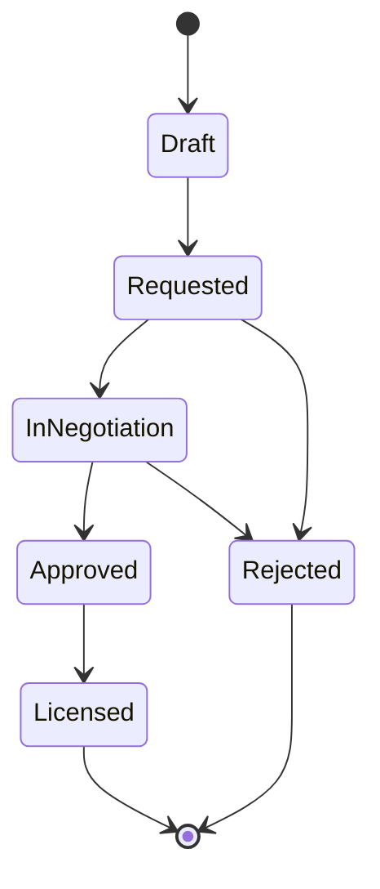

# License status workflow

Every track's `license_status` moves through a fixed set of states. The
transition rules live in one place — `can_transition` in
[`backend/src/domain/license.rs`](../backend/src/domain/license.rs) — and are
unit-tested there, independent of the HTTP layer or the database.

`Licensed` and `Rejected` are terminal: no transition starts from either.

| From | To | Meaning |
|---|---|---|
| `Draft` | `Requested` | The license request was sent to the rights holder. |
| `Requested` | `InNegotiation` | The rights holder responded; terms are being discussed. |
| `Requested` | `Rejected` | The rights holder declined outright. |
| `InNegotiation` | `Approved` | Terms were agreed. |
| `InNegotiation` | `Rejected` | The rights holder declined during negotiation. |
| `Approved` | `Licensed` | The license was signed / cleared. |

Any move not listed above — skipping a step (`Draft` → `Licensed`), going
backwards (`InNegotiation` → `Requested`), staying in place, or starting from
a terminal state — is rejected with `409 Conflict` by
`PATCH /tracks/{id}/license` (see the [API reference](../README.md#licensing-workflow)).

Every transition is recorded in `license_status_events`, so a track's full
negotiation history — not just its current state — is always available via
`GET /tracks/{id}`.
